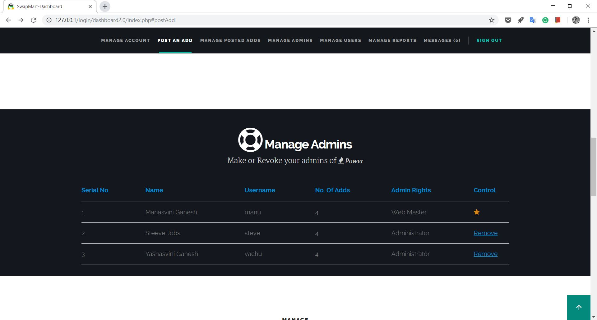

<h1>SwapMart</h1>
<h2>Configuration of the project for viewing</h2> 
<ol> 
  <li>Configure connect.php in "login" and "swapmart" directories accordin to your server (localhost or any remote server)</li>
  <li>Go to swapmart/index.php and launch the website</li>
  <li>To view the sample entries download swapmart.sql file and execute queries for creating database and tables as given in the file.  </li>
</ol>

<h2>Introduction</h2>
SwapMart is a C2C E Commerce Website. It provides a platform for students, staff and faculties to share, rent, and sell things. It could be anything in between an old toaster to drafter or calculator. It is also useful in sharing notes that are no longer needed. Or maybe even lend a bike for a ride! 

<h2>Features</h2>
<h3>Campus Verified Users</h3> 
Every student, faculty and staff are provided with campus ID. The same can be used for registering. 

 <h3>Users have following facilities</h3>
There are 3 types of Users, simple users, admin and webmasters. All three have different sets of rights as mentioned below.

  <h4>Users Rights</h4> 
  <ol>
	  <li>Post Advertisements</li>
	  <li>Report Advertisements - that are not ethical</li>
	  <li>Enquire about advertisements</li>
	  <li>Update Credentials</li>
	  <li>Delete Account</li>
	  <li>Re Create Deleted account with Re Live Option (but that does not load advertisements posted prior deletion.)</li>
	  <li>Respond to enquiries or messeges within dashboard</li>
	  <li>View and manage advertisements from dashboard</li>
	  <li>Bookmark advertisements for convinience. You may bookmark advertisements that you had sent an enquiry for.</li>
	  <li>Messges show - Read information. So If the advertiser or the enquirer reads your messege it is marked for you.</li>
	  <li><b>For trial purpose of knowing how things will be visible to an admin or web master "Promote Me" has been added per session.</b></li>
  </ol>
    
 <h4>Admin Rights </h4>
  <ol>
    <li>Do everything that users can do</li>
    <li>Manage Users - view and block/unblock them</li>
    <li>Manage reports - take action</li>
  </ol>

<h4>Web Master Rights </h4>
  <ol>
    <li>Do everything that admins can do</li>
    <li>Promote users as admins</li>
    <li>Manage Admins - depromote them</li>
  </ol>
  
 
 

<h3>Search Filters:</h3>
Based on classification the products in SwapMart can be classified as - 
 <ul>
    <li>
      Prcing Style 
      <ol>
        <li>Free</li>
        <li>Rent</li>
        <li>Buy</li>
      </ol>
    </li>
    <li>
      Category 
      <ol>
        <li>Notes</li>
        <li>Books</li>
        <li>Question Papers</li>
        <li>Quantum</li>
        <li>Decode</li>
        <li>Stationary</li>
        <li>Electronics</li>
        <li>Movies</li>
        <li>Others</li>
      </ol>
    </li>
 </ul>

 <h2>Achievement</h2>
<ol>
  <li>The project was appreciated in Nisarg 2016, the Annual Tech Fest. It was represented by CSE Department Society Genesis.</li>
	<li>The project won <b>Best Project Award</b> for final year project 2016-17</li>
 </ol>
